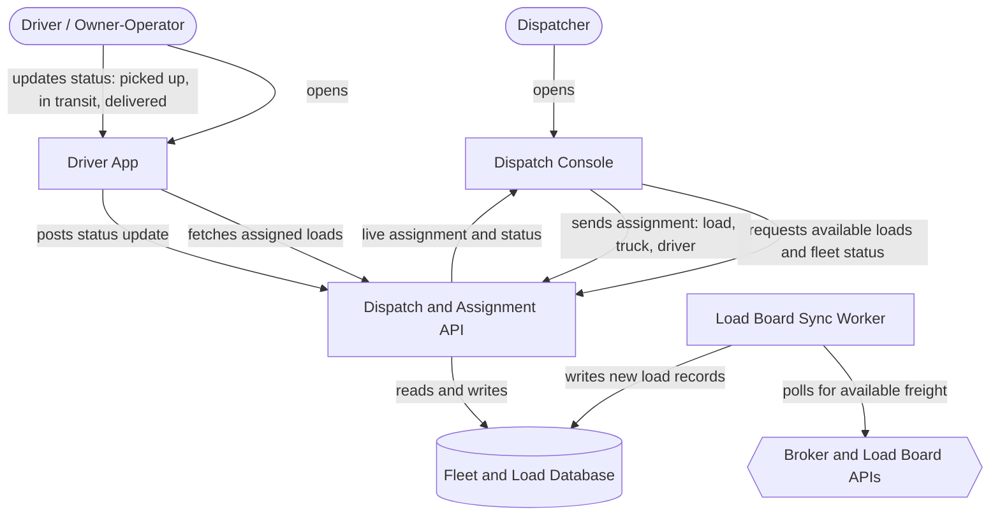

# Gato LLC — System Architecture

## The Idea

Gato LLC is a trucking/transportation company moving non-hazardous freight around the US. The system's day-to-day users are Gato's own dispatchers/staff, drivers/owner-operators, and brokers/load boards (as an external load source). The one thing this system must do well on day one: **reliably match available trucks/drivers to loads and track who is carrying what.**

## Components

| Component | What it does for Gato (plain English) | Words that required it |
|---|---|---|
| **Dispatch Console** | Gives Gato's dispatchers a screen showing every truck, driver, and open load, and lets them click to assign one to the other. | "Gato dispatchers/staff" (named user) + the day-one priority itself |
| **Driver App** | Lets drivers and owner-operators see the loads they've been given and tap a button to mark "picked up," "in transit," or "delivered." | "Drivers/owner-operators" (named user) |
| **Dispatch & Assignment API** | The engine that actually matches a load to a truck and driver, remembers the decision, and pushes status changes to everyone — this is the piece that has to work perfectly from day one. | "reliably match available trucks/drivers to loads and track who's carrying what" (the day-one sentence) |
| **Fleet & Load Database** | The permanent record of every load, truck, driver, and assignment, so nothing is forgotten between logins or lost when a screen closes. | "track who's carrying what" — state that must outlive a session |
| **Load Board Sync Worker** | Periodically checks outside freight marketplaces for loads Gato could carry, so dispatchers don't have to search manually. | "Brokers/load boards" (named source) |
| **Broker & Load Board APIs** | The external freight marketplaces (e.g. DAT, Truckstop.com) that list loads other companies need carried. | "Brokers/load boards" (named directly) |

No frontend was added for shippers/customers, and no AI/agent layer was added — neither was implied by the idea or the named users. No queue beyond the sync worker's own schedule was added — nothing else in the idea is bursty enough to need one.

## How It Fits Together

## Data Flow

1. The **Load Board Sync Worker** polls the **Broker & Load Board APIs** on a schedule for freight Gato could carry.
2. New loads are written into the **Fleet & Load Database**.
3. A dispatcher opens the **Dispatch Console**, which asks the **Dispatch & Assignment API** for the current loads, trucks, and drivers.
4. The API reads that state from the **Database** and returns it to the Console.
5. The dispatcher assigns a specific load to a specific driver/truck in the Console.
6. The Console sends that assignment to the API, which writes it to the Database as the permanent record.
7. A driver opens the **Driver App**, which fetches their newly assigned loads from the API.
8. As the driver picks up, transports, and delivers the load, they update status in the Driver App.
9. Each status update is sent to the API and written to the Database.
10. The Dispatch Console reflects those status changes back to the dispatcher in near real time, so they always know who is carrying what.

## Build Order

| Phase | Scope | What it proves |
|---|---|---|
| **1 — Core Dispatch** | Data model + Dispatch Console + manual load entry + assignment logic | The day-one priority works end to end, even before any outside integration exists |
| **2 — Driver Loop** | Driver App: assigned-load view, status updates, proof of delivery | The assignment is visible and actionable to the people actually doing the work |
| **3 — Automated Sourcing** | Load Board Sync Worker + broker/load board integration | Loads no longer have to be typed in by hand |
| **4 — Back Office** *(deferred)* | Compliance documents, invoicing, reporting | Not designed here — see below |

## Assumptions

| Assumption | Impact if wrong |
|---|---|
| Gato dispatches its own fleet and contracted owner-operators, not a public marketplace where any driver self-assigns | No self-serve driver bidding was designed; dispatchers hold assignment authority. If wrong, the Dispatch Console needs a driver-facing bidding view. |
| "Non-hazardous" means no HAZMAT-specific compliance workflow is needed on day one | Compliance/DOT documentation is deferred to Phase 4. If wrong, a compliance component must move into Phase 1. |
| The Load Board Sync Worker only pulls loads in (read-only), not posts Gato's own loads out for others to bid on | Broker integration is one-directional. If wrong, the Worker needs a posting path and the Broker APIs become bidirectional. |
| U.S. domestic freight only, single time-zone handling model | No customs, cross-border, or multi-currency handling exists. If wrong, the Database and API need locale/currency fields. |
| Shippers (freight customers) are not direct system users on day one | No customer-facing quoting/booking portal was designed. If wrong, a new frontend and API surface are needed. |

## What This Design Does Not Cover

- Customer-facing quoting or booking portal for shippers
- Invoicing, billing, and payment processing
- Compliance/DOT paperwork, ELD integration, hours-of-service tracking
- Real-time GPS/telematics hardware integration (status here is driver-reported, not GPS-tracked)
- Route optimization, fuel, or maintenance management
- Reporting/analytics dashboards
